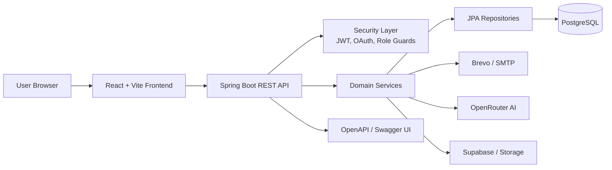

# Campus Recruitment Portal

Campus Recruitment Portal is a full-stack recruitment platform for universities, students, companies, and placement cells. The backend is a Spring Boot application that owns authentication, business rules, persistence, mail, AI assistance, and APIs. The frontend is a React + Vite single-page app that renders the role-specific experience and talks to the backend through typed service wrappers.

## What This Project Does

- Students can register, verify their email, sign in, browse eligible jobs, and apply.
- Companies can register, post jobs, edit openings, and track their hiring activity.
- Placement cell users can review jobs, pending approvals, and overall placement status.
- Admin-facing flows cover system-wide oversight, seed data, and operational tasks.
- The platform includes Google sign-in, email delivery through Brevo, AI text assistance, and resumable JWT-based authentication.

## Architecture Overview



### Backend Design

- `CampusRecruitmentPortalApplication` starts the Spring Boot app and enables JPA auditing, async execution, and scheduled jobs.
- Controllers expose REST endpoints for auth, jobs, placement, student, company, and AI features.
- Services contain the business rules, including eligibility checks, approval flows, login sessions, notifications, and email delivery.
- Repositories isolate database access through Spring Data JPA.
- Configuration classes bind typed settings from `application.yml` and the profile-specific YAML files.
- Flyway migrations build and seed the schema before the application serves traffic.

### Frontend Design

- The frontend router separates public pages from protected role-based dashboard routes.
- `ProtectedRoute` prevents users from rendering screens outside their role.
- Shared layout components keep the student, company, and placement views consistent.
- Feature folders group auth, AI, student, placement, job, and service logic by domain.
- Typed API helpers keep the UI aligned with backend contracts.

## How the App Works

1. A user opens the React app and lands on a public page such as login, registration, or the landing screen.
2. After authentication, the frontend stores the token/session state and uses role-based routes to render the correct dashboard.
3. Dashboard actions call the backend REST API through service modules in the frontend.
4. The backend validates the request, checks permissions, runs the relevant service logic, and updates the database.
5. Supporting integrations handle email delivery, Google sign-in verification, AI-assisted text responses, and storage operations.
6. The frontend refreshes the UI with the result and keeps the user inside the correct role area.

## Tech Stack

- Backend: Java 21, Spring Boot 3.3.4, Spring Security, Spring Data JPA, Flyway, PostgreSQL
- Frontend: React 19, TypeScript, Vite, Tailwind CSS, TanStack Query
- Integrations: Google sign-in, Brevo email, OpenRouter AI, Supabase storage

## Repository Structure

- `pom.xml` - backend build and dependency management
- `mvnw` / `mvnw.cmd` - Maven wrapper for repeatable backend builds
- `run.sh` / `run.cmd` - backend startup helpers that load local environment variables
- `src/main/java` - Spring Boot application code
- `src/main/resources` - backend configuration and database migrations
- `src/test/java` - backend tests
- `frontend/` - Vite application and UI code
- `frontend/src/app` - router and route metadata
- `frontend/src/components` - shared UI and layout components
- `frontend/src/features` - domain-specific frontend features
- `frontend/src/pages` - route-level screens
- `frontend/src/services` - frontend API clients

## Prerequisites

- Java 21
- Maven 3.9+ or the included Maven wrapper
- Node.js 20+ and npm
- PostgreSQL

## Environment Setup

1. Create a root `.env` file for backend runtime values.
2. If the frontend needs local variables, create `frontend/.env` or `frontend/.env.local`.
3. Install frontend dependencies with `cd frontend && npm install`.
4. Point the backend at PostgreSQL and any external integrations you want to use.

### Important Environment Values

- `DATABASE_URL`, `DATABASE_USERNAME`, and `DATABASE_PASSWORD`
- `JWT_SECRET`
- `BREVO_API_KEY` or SMTP settings
- `GOOGLE_CLIENT_ID` and `GOOGLE_CLIENT_SECRET`
- `OPENROUTER` / AI-related variables if AI support is enabled

## Running the Project

### Backend

On macOS/Linux:

```bash
./run.sh
```

On Windows:

```cmd
run.cmd
```

The backend starts on port `8080` by default.

### Frontend

```bash
cd frontend
npm run dev
```

The Vite app runs on port `5173` by default.

## Backend Configuration

- `src/main/resources/application.yml` contains the shared production-safe defaults.
- `src/main/resources/application-dev.yml` contains local development overrides.
- `src/main/resources/application-prod.yml` contains production-oriented values.
- Database migrations live under `src/main/resources/db/migration`.

## Frontend Routing

The frontend router groups the app into public and protected areas:

- Public routes: landing, login, register, forgot password, reset password, verify email
- Student routes: dashboard, eligible jobs, applications
- Company routes: dashboard, job list, create/edit/details
- Placement routes: dashboard, pending jobs, job detail

The router uses role-based protection so the UI only renders screens that match the signed-in user’s access level.

## API and Documentation

- OpenAPI docs: `/swagger-ui.html`
- API spec: `/v3/api-docs`

## GitHub Workflow

This repository is intended to be pushed as a normal GitHub project with the following flow:

1. Keep source code, configuration templates, and documentation in the repository.
2. Keep secrets in environment files or platform secret managers, not in tracked config.
3. Use GitHub to review commit history, changes, and pull requests.
4. Use branch protection or repository rules to block accidental secret commits.
5. Keep the README as the main entry point for new contributors and reviewers.

## Development Notes

- The backend is designed around layered architecture: controller, service, repository, entity, DTO, and config.
- The frontend is organized by feature so related UI, hooks, and service calls stay together.
- `npm run build` validates the frontend bundle.
- The Maven wrapper validates the backend build.

## Suggested Next Steps

- Run the backend and frontend locally to verify the environment values.
- Open the Swagger UI to inspect the API contract.
- Review the route structure in `frontend/src/app/router.tsx` if you want to extend a role area.
